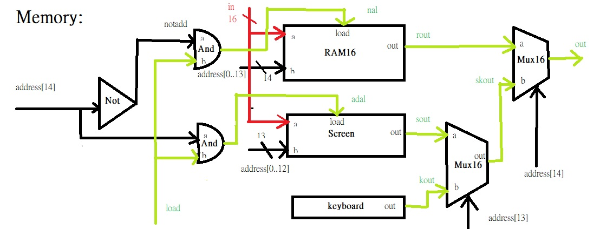

Memory:
CHIP Memory {
    IN in[16], load, address[15];
    OUT out[16];

    PARTS:
    // Put your code here:
    Not(in=address[14], out=notadd);
    And(a=notadd, b=load, out=nal);
    And(a=address[14], b=load, out=adal);
    RAM16K(in=in, address=address[0..13], load=nal, out=rout);
    Screen(in=in, address=address[0..12], load=adal, out=sout);
    Keyboard(out=kout);
    Mux16(a=sout, b=kout, sel=address[13], out=skout);
    Mux16(a=rout, b=skout, sel=address[14], out=out);
}

//address[14] --> address 16384  to Screen site start, address 16384-1=16383  to data memory site final
//address[13] --> address 16384 + 8192 = 24576 to keyboard site start, address 24576 - 1 = 24575 to Screen site final

