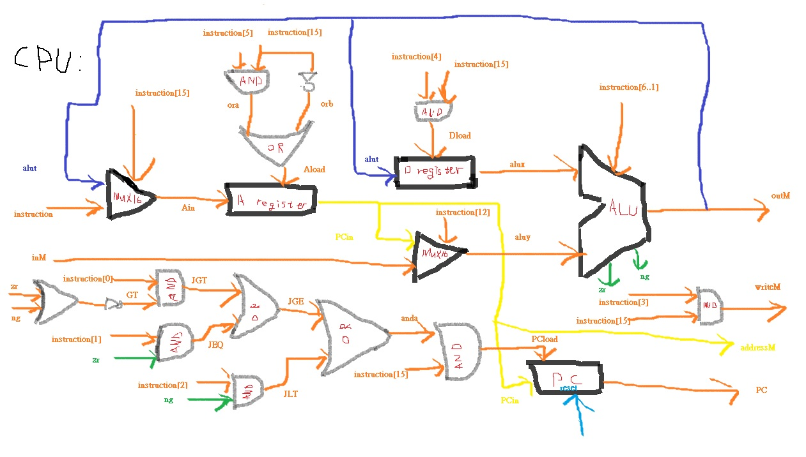

CPU:  
CHIP CPU {

    IN  inM[16],         // M value input  (M = contents of RAM[A])
        instruction[16], // Instruction for execution
        reset;           // Signals whether to re-start the current
                         // program (reset==1) or continue executing
                         // the current program (reset==0).

    OUT outM[16],        // M value output
        writeM,          // Write to M? 
        addressM[15],    // Address in data memory (of M)
        pc[15];          // address of next instruction

    PARTS:
    // Put your code here:
    Mux16(a=instruction, b=alut, sel=instruction[15], out=Ain);

    And(a=instruction[5], b=instruction[15], out=ora);
    Not(in=instruction[15], out=orb);
    Or(a=ora, b=orb, out=Aload);

    ARegister(in=Ain, load=Aload, out=PCin, out[0..14]=addressM);

    Mux16(a=PCin, b=inM, sel=instruction[12], out=aluy);

    And(a=instruction[4], b=instruction[15], out=Dload);

    DRegister(in=alut, load=Dload, out=alux);

    ALU(x=alux, y=aluy, zx=instruction[11], nx=instruction[10], zy=instruction[9], ny=instruction[8], f=instruction[7], no=instruction[6], out=outM, out=alut, zr=zr, ng=ng);

    And(a=instruction[15], b=instruction[3], out=writeM);

    //reset and jump
    Or(a=zr, b=ng, out=zrong);
    Not(in=zrong, out=GT);
    And(a=GT, b=instruction[0], out=JGT);
    And(a=zr, b=instruction[1], out=JEQ);
    Or(a=JGT, b=JEQ, out=JGE);
    And(a=ng, b=instruction[2], out=JLT);
    Or(a=JGE, b=JLT, out=anda);
    And(a=anda, b=instruction[15], out=PCload);

    PC(in=PCin, load=PCload, inc=true, reset=reset, out[0..14]=pc);
}

