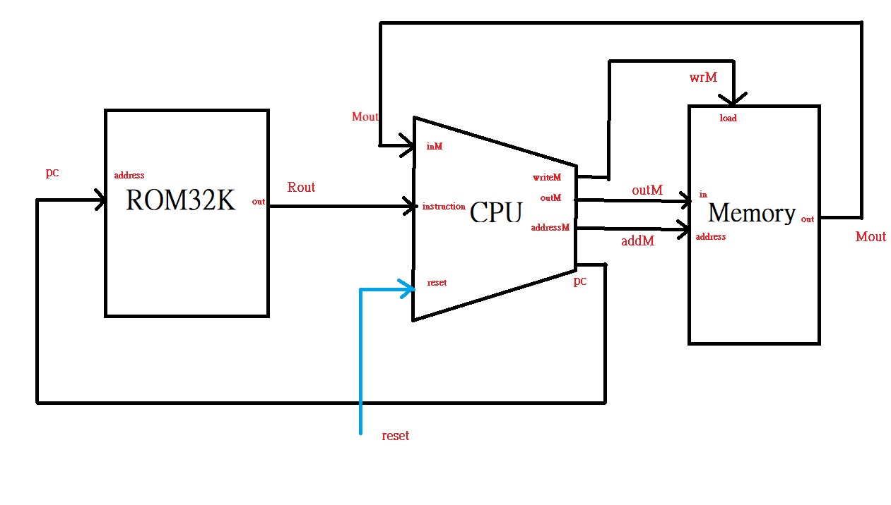

Computer:  
CHIP Computer {

    IN reset;

    PARTS:
    // Put your code here:
    ROM32K(address=pc, out= Rout);
    CPU(inM=Mout, instruction=Rout, reset=reset, outM=outM, writeM= wrM, addressM=addM, pc=pc);
    Memory(in=outM, load=wrM, address=addM, out=Mout);
}

