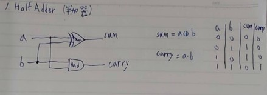
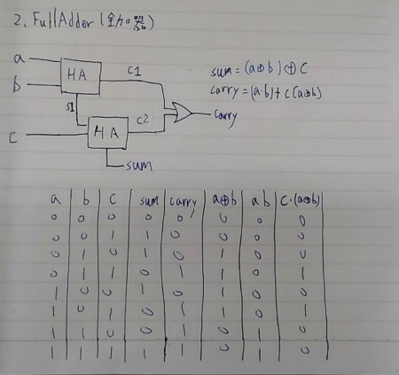
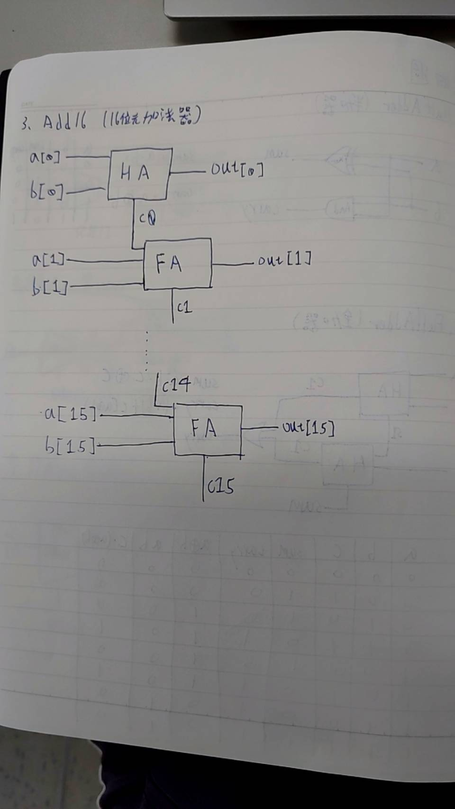
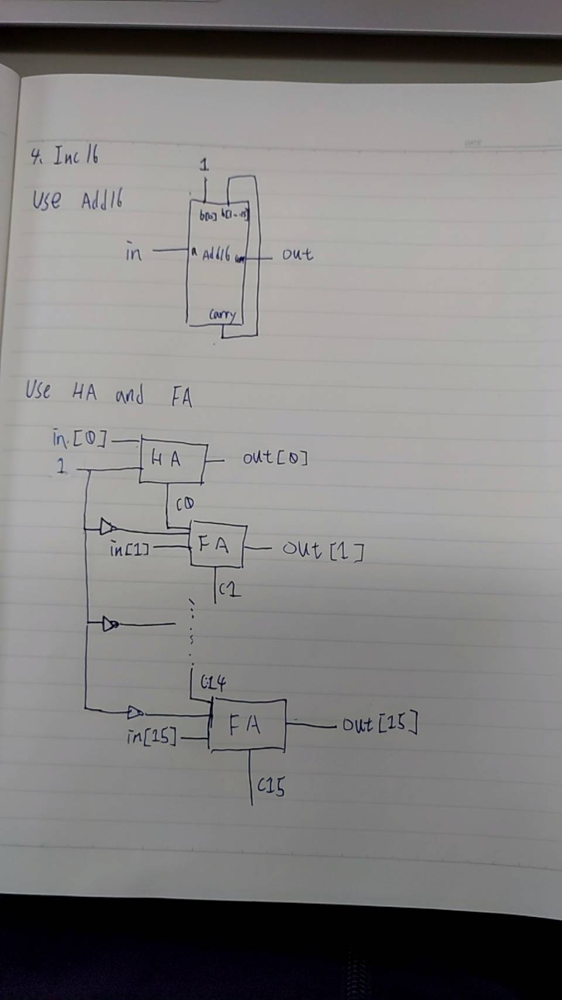

1.HalfAdder

CHIP HalfAdder {
    IN a, b;    // 1-bit inputs
    OUT sum,    // Right bit of a + b 
        carry;  // Left bit of a + b

    PARTS:
    And(a=a, b=b, out=carry);
    Xor(a=a, b=b, out=sum);
    // Put you code here:
}

2.FullAdder

CHIP FullAdder {
    IN a, b, c;  // 1-bit inputs
    OUT sum,     // Right bit of a + b + c
        carry;   // Left bit of a + b + c

    PARTS:
    HalfAdder(a=a, b=b, sum=s1, carry=c1);
    HalfAdder(a=s1, b=c, sum=sum, carry=c2);
    Or(a=c1, b=c2, out=carry);
    // Put you code here:
}

3.Add16

CHIP Add16 {
    IN a[16], b[16];
    OUT out[16];

    PARTS:
    HalfAdder(a=a[0], b=b[0], sum=out[0], carry=c0);
    FullAdder(a=a[1], b=b[1], c=c0, sum=out[1], carry=c1);
    FullAdder(a=a[2], b=b[2], c=c1, sum=out[2], carry=c2);
    FullAdder(a=a[3], b=b[3], c=c2, sum=out[3], carry=c3);
    FullAdder(a=a[4], b=b[4], c=c3, sum=out[4], carry=c4);
    FullAdder(a=a[5], b=b[5], c=c4, sum=out[5], carry=c5);
    FullAdder(a=a[6], b=b[6], c=c5, sum=out[6], carry=c6);
    FullAdder(a=a[7], b=b[7], c=c6, sum=out[7], carry=c7);
    FullAdder(a=a[8], b=b[8], c=c7, sum=out[8], carry=c8);
    FullAdder(a=a[9], b=b[9], c=c8, sum=out[9], carry=c9);
    FullAdder(a=a[10], b=b[10], c=c9, sum=out[10], carry=c10);
    FullAdder(a=a[11], b=b[11], c=c10, sum=out[11], carry=c11);
    FullAdder(a=a[12], b=b[12], c=c11, sum=out[12], carry=c12);
    FullAdder(a=a[13], b=b[13], c=c12, sum=out[13], carry=c13);
    FullAdder(a=a[14], b=b[14], c=c13, sum=out[14], carry=c14);
    FullAdder(a=a[15], b=b[15], c=c14, sum=out[15], carry=c15);
   // Put you code here:
}

4.Inc16

CHIP Inc16 {
    IN in[16];
    OUT out[16];

    PARTS:
    //use Add16
    Add16(a=in[0..15], b[0]=true, b[1..15]=false, out=out[0..15]);

    //use one HalfAdder and 15 FullAdders
    /*HalfAdder(a=in[0], b=true, sum=out[0], carry=c0);
    FullAdder(a=in[1], b=false, c=c0, sum=out[1], carry=c1);
    FullAdder(a=in[2], b=false, c=c1, sum=out[2], carry=c2);
    FullAdder(a=in[3], b=false, c=c2, sum=out[3], carry=c3);
    FullAdder(a=in[4], b=false, c=c3, sum=out[4], carry=c4);
    FullAdder(a=in[5], b=false, c=c4, sum=out[5], carry=c5);
    FullAdder(a=in[6], b=false, c=c5, sum=out[6], carry=c6);
    FullAdder(a=in[7], b=false, c=c6, sum=out[7], carry=c7);
    FullAdder(a=in[8], b=false, c=c7, sum=out[8], carry=c8);
    FullAdder(a=in[9], b=false, c=c8, sum=out[9], carry=c9);
    FullAdder(a=in[10], b=false, c=c9, sum=out[10], carry=c10);
    FullAdder(a=in[11], b=false, c=c10, sum=out[11], carry=c11);
    FullAdder(a=in[12], b=false, c=c11, sum=out[12], carry=c12);
    FullAdder(a=in[13], b=false, c=c12, sum=out[13], carry=c13);
    FullAdder(a=in[14], b=false, c=c13, sum=out[14], carry=c14);
    FullAdder(a=in[15], b=false, c=c14, sum=out[15], carry=c15);
    */
   // Put you code here:
}