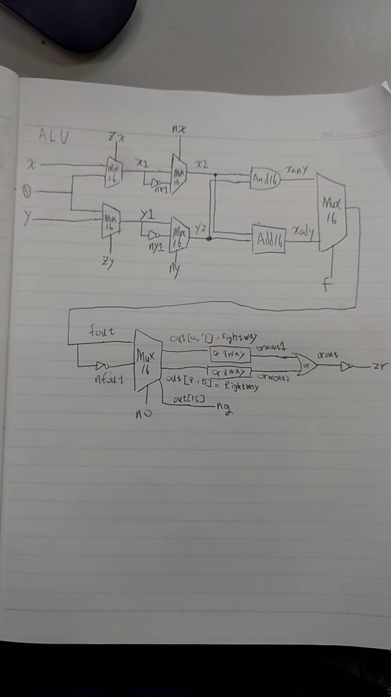

1.ALU-nostat

CHIP ALU-nostat {
    IN  
        x[16], y[16],  // 16-bit inputs        
        zx, // zero the x input?
        nx, // negate the x input?
        zy, // zero the y input?
        ny, // negate the y input?
        f,  // compute out = x + y (if 1) or x & y (if 0)
        no; // negate the out output?

    OUT 
        out[16]; // 16-bit output

    PARTS:
   // Put you code here:
    
    Mux16(a=x, b=false, sel=zx, out=x1); // zx
    Not16(in=x1, out=nx1);
    Mux16(a=x1, b=nx1, sel=nx, out=x2); // nx

    Mux16(a=y, b=false, sel=zy, out=y1); // zy
    Not16(in=y1, out=ny1);
    Mux16(a=y1, b=ny1, sel=ny, out=y2); // ny

    And16(a=x2, b=y2, out=xany); // f=0
    Add16(a=x2, b=y2, out=xady); // f=1

    Mux16(a=xany, b=xady, sel=f, out=fout); // no=0
    Not16(in=fout, out=nfout); // no=1
    
    Mux16(a=fout, b=nfout, sel=no, out=out);

}

2.ALU

CHIP ALU {
    IN  
        x[16], y[16],  // 16-bit inputs        
        zx, // zero the x input?
        nx, // negate the x input?
        zy, // zero the y input?
        ny, // negate the y input?
        f,  // compute out = x + y (if 1) or x & y (if 0)
        no; // negate the out output?

    OUT 
        out[16], // 16-bit output
        zr, // 1 if (out == 0), 0 otherwise
        ng; // 1 if (out < 0),  0 otherwise

    PARTS:
   // Put you code here:
    
    Mux16(a=x, b=false, sel=zx, out=x1); // zx
    Not16(in=x1, out=nx1);
    Mux16(a=x1, b=nx1, sel=nx, out=x2); // nx

    Mux16(a=y, b=false, sel=zy, out=y1); // zy
    Not16(in=y1, out=ny1);
    Mux16(a=y1, b=ny1, sel=ny, out=y2); // ny

    And16(a=x2, b=y2, out=xany); // f=0
    Add16(a=x2, b=y2, out=xady); // f=1

    Mux16(a=xany, b=xady, sel=f, out=fout); // no=0
    Not16(in=fout, out=nfout); // no=1
    
    Mux16(a=fout, b=nfout, sel=no, out=out, out[0..7]=Rightway, out[8..15]=Leftway, out[15]=ng);

    Or8Way(in=Rightway, out=orwout1);
    Or8Way(in=Leftway, out=orwout2);
    Or(a=orwout1, b=orwout2, out=orout);
    Not(in=orout, out=zr);
    
}

