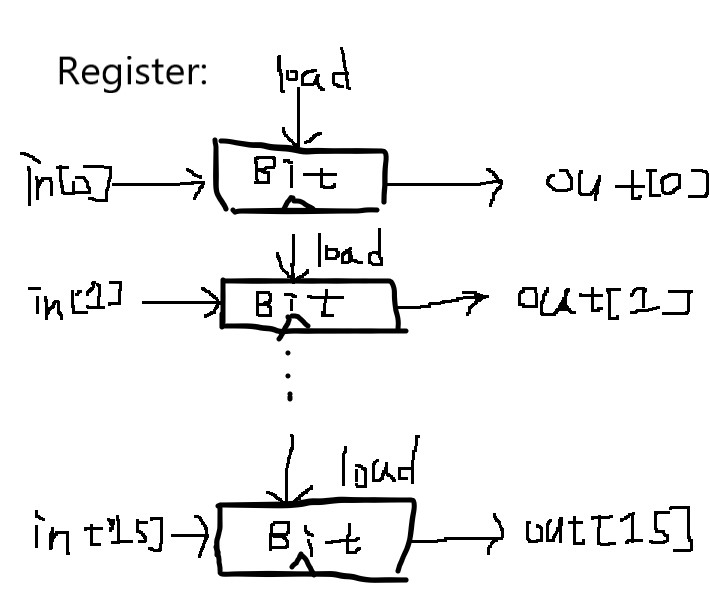

1. Bit

CHIP Bit {
    IN in, load;
    OUT out;

    PARTS:
    // Put your code here:
    Mux(a=outdf, b=in, sel=load, out=outmux);
    DFF(in=outmux, out=out, out=outdf)
}

2.Register

CHIP Register {
    IN in[16], load;
    OUT out[16];

    PARTS:
    // Put your code here:
    Bit(in = in[0], load=load, out=out[0]);
    Bit(in = in[1], load=load, out=out[1]);
    Bit(in = in[2], load=load, out=out[2]);
    Bit(in = in[3], load=load, out=out[3]);
    Bit(in = in[4], load=load, out=out[4]);
    Bit(in = in[5], load=load, out=out[5]);
    Bit(in = in[6], load=load, out=out[6]);
    Bit(in = in[7], load=load, out=out[7]);
    Bit(in = in[8], load=load, out=out[8]);
    Bit(in = in[9], load=load, out=out[9]);
    Bit(in = in[10], load=load, out=out[10]);
    Bit(in = in[11], load=load, out=out[11]);
    Bit(in = in[12], load=load, out=out[12]);
    Bit(in = in[13], load=load, out=out[13]);
    Bit(in = in[14], load=load, out=out[14]);
    Bit(in = in[15], load=load, out=out[15]);
}

