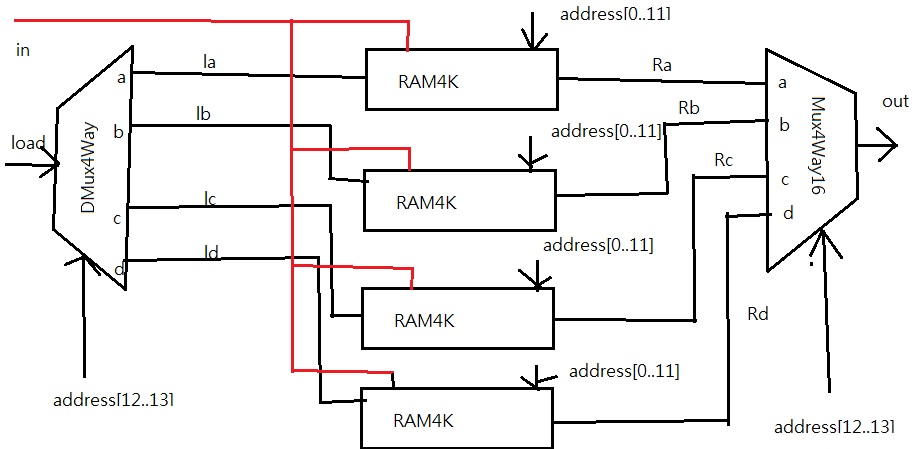

1.RAM8

CHIP RAM8 {
    IN in[16], load, address[3];
    OUT out[16];

    PARTS:
    // Put your code here:
    DMux8Way(in=load, sel=address, a=la, b=lb, c=lc, d=ld, e=le, f=lf, g=lg, h=lh);
    Register(in=in, load=la, out=ora);
    Register(in=in, load=lb, out=orb);
    Register(in=in, load=lc, out=orc);
    Register(in=in, load=ld, out=ord);
    Register(in=in, load=le, out=ore);
    Register(in=in, load=lf, out=orf);
    Register(in=in, load=lg, out=org);
    Register(in=in, load=lh, out=orh);
    Mux8Way16(a=ora, b=orb, c=orc, d=ord, e=ore, f=orf, g=org, h=orh, sel=address, out=out);
}

2.RAM64

CHIP RAM64 {
    IN in[16], load, address[6];
    OUT out[16];

    PARTS:
    // Put your code here:
    DMux8Way(in=load, sel=address[3..5], a=la, b=lb, c=lc, d=ld, e=le, f=lf, g=lg, h=lh);
    RAM8(in=in, load=la, address=address[0..2], out=Ra);
    RAM8(in=in, load=lb, address=address[0..2], out=Rb);
    RAM8(in=in, load=lc, address=address[0..2], out=Rc);
    RAM8(in=in, load=ld, address=address[0..2], out=Rd);
    RAM8(in=in, load=le, address=address[0..2], out=Re);
    RAM8(in=in, load=lf, address=address[0..2], out=Rf);
    RAM8(in=in, load=lg, address=address[0..2], out=Rg);
    RAM8(in=in, load=lh, address=address[0..2], out=Rh);
    Mux8Way16(a=Ra, b=Rb, c=Rc, d=Rd, e=Re, f=Rf, g=Rg, h=Rh, sel=address[3..5], out=out);
}

3.RAM512

CHIP RAM512 {
    IN in[16], load, address[9];
    OUT out[16];

    PARTS:
    // Put your code here:
    DMux8Way(in=load, sel=address[6..8], a=la, b=lb, c=lc, d=ld, e=le, f=lf, g=lg, h=lh);
    RAM64(in=in, load=la, address=address[0..5], out=Ra);
    RAM64(in=in, load=lb, address=address[0..5], out=Rb);
    RAM64(in=in, load=lc, address=address[0..5], out=Rc);
    RAM64(in=in, load=ld, address=address[0..5], out=Rd);
    RAM64(in=in, load=le, address=address[0..5], out=Re);
    RAM64(in=in, load=lf, address=address[0..5], out=Rf);
    RAM64(in=in, load=lg, address=address[0..5], out=Rg);
    RAM64(in=in, load=lh, address=address[0..5], out=Rh);
    Mux8Way16(a=Ra, b=Rb, c=Rc, d=Rd, e=Re, f=Rf, g=Rg, h=Rh, sel=address[6..8], out=out);
}

4.RAM4K

CHIP RAM4K {
    IN in[16], load, address[12];
    OUT out[16];

    PARTS:
    // Put your code here:
    DMux8Way(in=load, sel=address[9..11], a=la, b=lb, c=lc, d=ld, e=le, f=lf, g=lg, h=lh);
    RAM512(in=in, load=la, address=address[0..8], out=Ra);
    RAM512(in=in, load=lb, address=address[0..8], out=Rb);
    RAM512(in=in, load=lc, address=address[0..8], out=Rc);
    RAM512(in=in, load=ld, address=address[0..8], out=Rd);
    RAM512(in=in, load=le, address=address[0..8], out=Re);
    RAM512(in=in, load=lf, address=address[0..8], out=Rf);
    RAM512(in=in, load=lg, address=address[0..8], out=Rg);
    RAM512(in=in, load=lh, address=address[0..8], out=Rh);
    Mux8Way16(a=Ra, b=Rb, c=Rc, d=Rd, e=Re, f=Rf, g=Rg, h=Rh, sel=address[9..11], out=out);
}

5.RAM16K

CHIP RAM16K {
    IN in[16], load, address[14];
    OUT out[16];

    PARTS:
    // Put your code here:
    DMux4Way(in=load, sel=address[12..13], a=la, b=lb, c=lc, d=ld);
    RAM4K(in=in, load=la, address=address[0..11], out=Ra);
    RAM4K(in=in, load=lb, address=address[0..11], out=Rb);
    RAM4K(in=in, load=lc, address=address[0..11], out=Rc);
    RAM4K(in=in, load=ld, address=address[0..11], out=Rd);
    Mux4Way16(a=Ra, b=Rb, c=Rc, d=Rd, sel=address[12..13], out=out);
}

