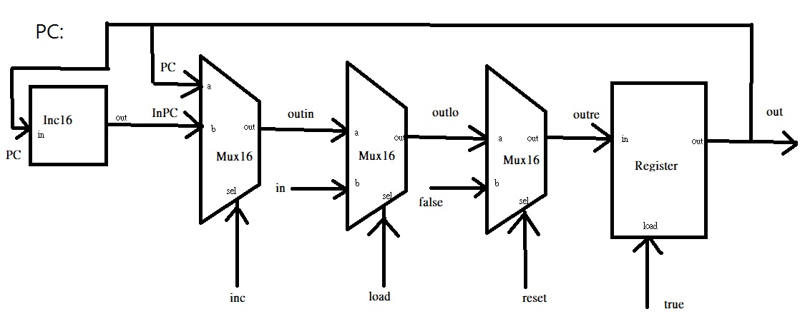

PC

CHIP PC {
    IN in[16],load,inc,reset;
    OUT out[16];

    PARTS:
    // Put your code here:
    Inc16(in=PC, out=InPC);
    Mux16(a=PC, b=InPC, sel=inc, out=outin);
    Mux16(a=outin, b=in, sel=load, out=outlo);
    Mux16(a=outlo, b=false, sel=reset, out=outre);
    Register(in=outre, load=true, out=PC, out=out);
}

