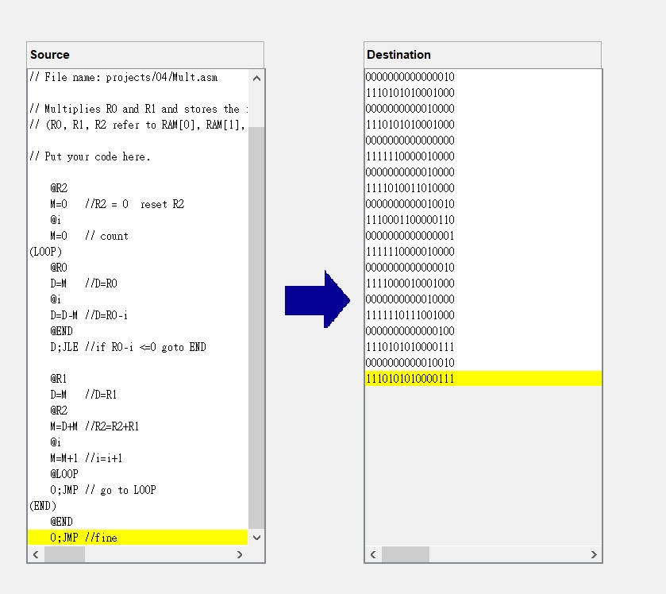
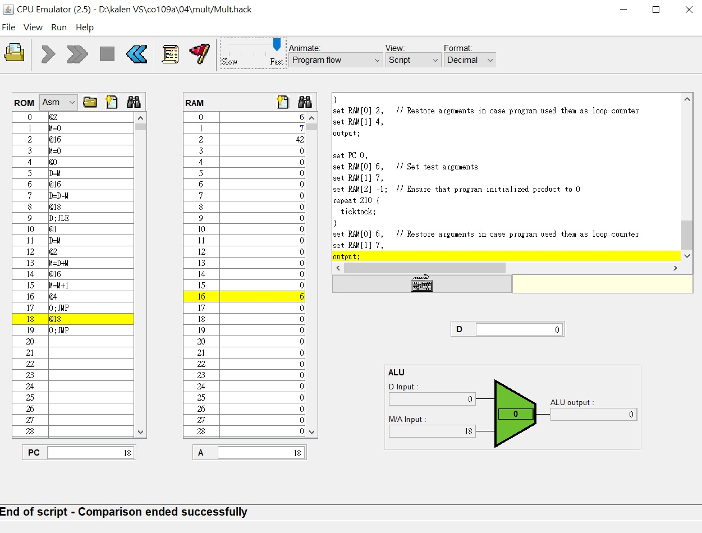

mult:  
// Put your code here.  

    @R2  
    M=0   //R2 = 0  reset R2  
    @i  
    M=0   // count  
    (LOOP)  
    @R0  
    D=M   //D=R0  
    @i  
    D=D-M //D=R0-i  
    @END  
    D;JLE //if R0-i <=0 goto END  
  
    @R1  
    D=M   //D=R1  
    @R2  
    M=D+M //R2=R2+R1  
    @i  
    M=M+1 //i=i+1  
    @LOOP  
    0;JMP // go to LOOP  
    (END)  
    @END  
    0;JMP //fine  

