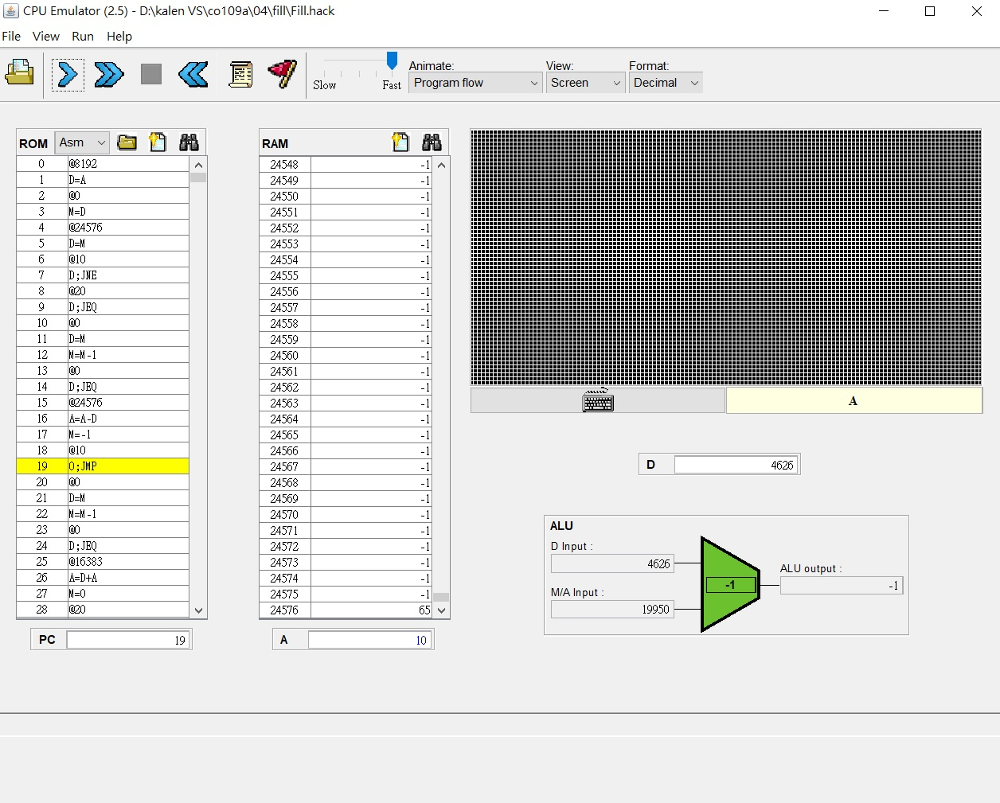
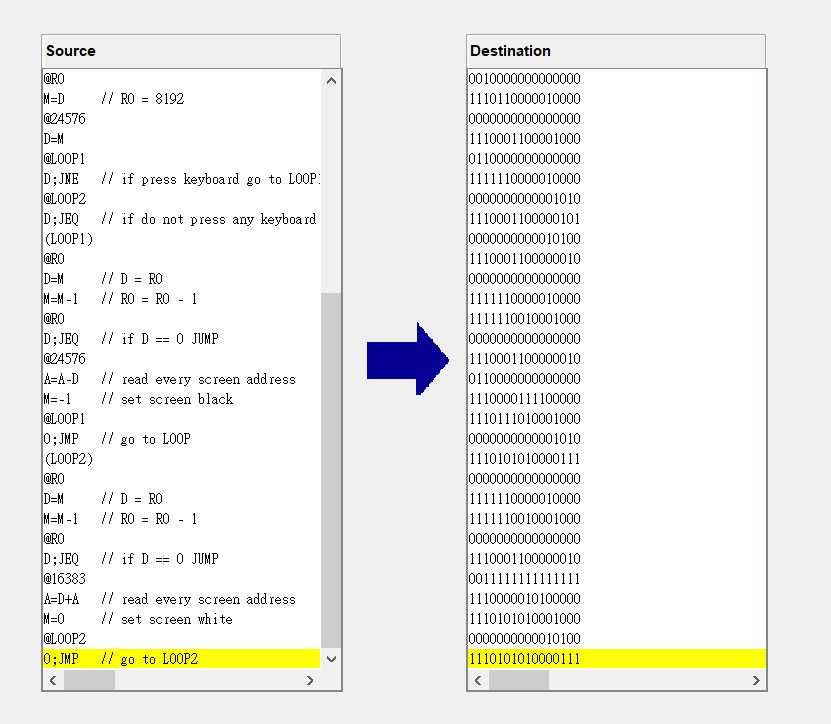

Fill:
// Put your code here.

    @8192   //16384~24575  screen
    D=A
    @R0
    M=D     // R0 = 8192
    @24576
    D=M
    @LOOP1
    D;JNE   // if press keyboard go to LOOP1
    @LOOP2
    D;JEQ   // if do not press any keyboard go to LOOP2
    (LOOP1)
    @R0
    D=M     // D = R0
    M=M-1   // R0 = R0 - 1
    @R0
    D;JEQ   // if D == 0 JUMP
    @24576
    A=A-D   // read every screen address
    M=-1    // set screen black
    @LOOP1
    0;JMP   // go to LOOP
    (LOOP2)
    @R0     
    D=M     // D = R0
    M=M-1   // R0 = R0 - 1
    @R0
    D;JEQ   // if D == 0 JUMP
    @16383
    A=D+A   // read every screen address
    M=0     // set screen white
    @LOOP2
    0;JMP   // go to LOOP2

